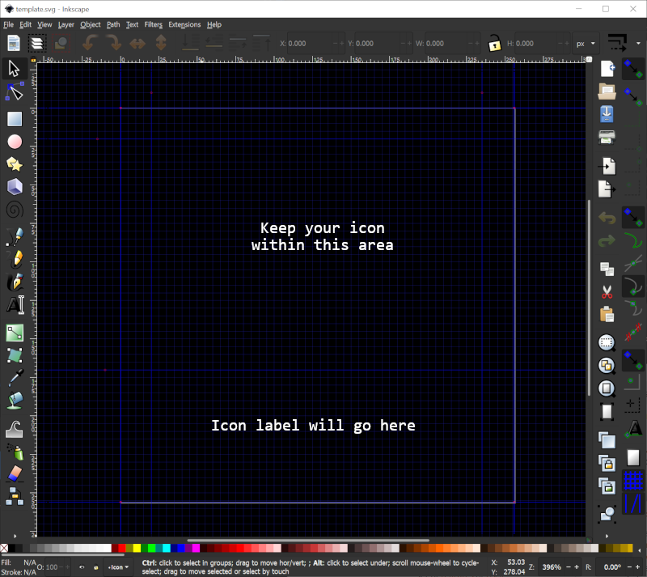

Stream Deck Icon Pack for Visual Studio & Visual Studio Code
============================================================

Themeable, language-neutral icons for the Stream Deck Visual Studio and Visual Studio Code.


This project contains icons for use with the [Elgato Stream Deck](https://www.elgato.com/en/gaming/stream-deck)
family of programmable LCD button boxes that are designed to work with the [Visual Studio](https://github.com/nicollasricas/streamdeckvs) and [Visual Studio Code](https://github.com/nicollasricas/streamdeckvsc) plugins.

# Features

* The SVG-based icons in this pack are themeable, allowing you to select different colors for "normal", "active", "warning" and "disabled" icon states depending on your needs.
* Icons do not include any English text labels - rather you can use the button title functionality of the Stream Deck software to label your buttons using the terminology/language that you prefer.
* Several pre-generated icon packs are included in various themes. The automated build process allows you to easily generate new sets of custom themed icons.

# Installation

First, install the [Stream Deck Visual Studio Plug-In](https://github.com/nicollasricas/streamdeckvs) if you haven't already, then install the Stream Deck for Visual Studio Code extension from the VS Code extension marketplace.

Download the latest release of the icon pack from the [Releases]() page.

To use the icons, copy the icon set of your choice to your Documents folder or some other convenient location then use the Stream Deck configuration application to drag actions onto the panel layout.

# Building a Custom Icon Set

To generate your own theme, you will need [ImageMagick](https://imagemagick.org/index.php) 7.0+ and the "magick" command must be in your path (e.g. `C:\Program Files\ImageMagick-7.0.10-Q16-HDRI`).

From the root of the streamdeck-vs-icons directory, run the built.bat file to generate a new icon set:

```
.\build.bat <theme name> <normal color> <active color> <warning color> <disabled color>
```

Place each argument in quotes. Colors must be specified in a form recognized by ImageMagick. For example:

```
.\build.bat "Orange" "#FF7F00" "#f0f0f0" "#e0e020" "#202020"
```

The icons will be generated into the `<theme name>` folder.

# Making New Icons

Icons can be created in [InkScape](https://inkscape.org/) or another SVG image editor. Use the `template.svg` file as a starting point. This template includes guides that will help properly format your icons so they will display well with label text:


